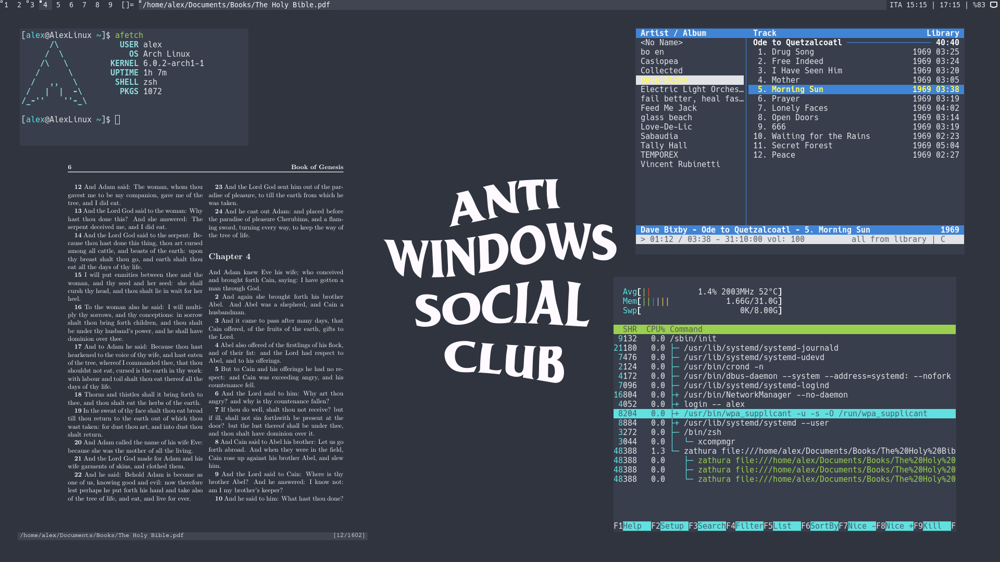

# What is this?

Denshi's dotfiles and autoconfig script.
(For Arch-based Linux Distributions)
 

# What configs does it have?

* Suckless' DWM (Colors, keybinds and a system tray)
* Zsh (Prompt and syntax-highlighting)
* GTK (Arc Dark theme)
* QT (Arc Dark theme, from Kvantum)
* htop (Minimal layout)
* dunst (Colors and dimensions)
* mpv (Disable pitch correction)
* newsboat (Colored separators and cool URLs)
* zathura (Colors and clipboard selection)

# What about the scripts? (like cvrt)
All of my scripts are located in my [Scripts repository.](https://codeberg.org/Denshi/Scripts)
