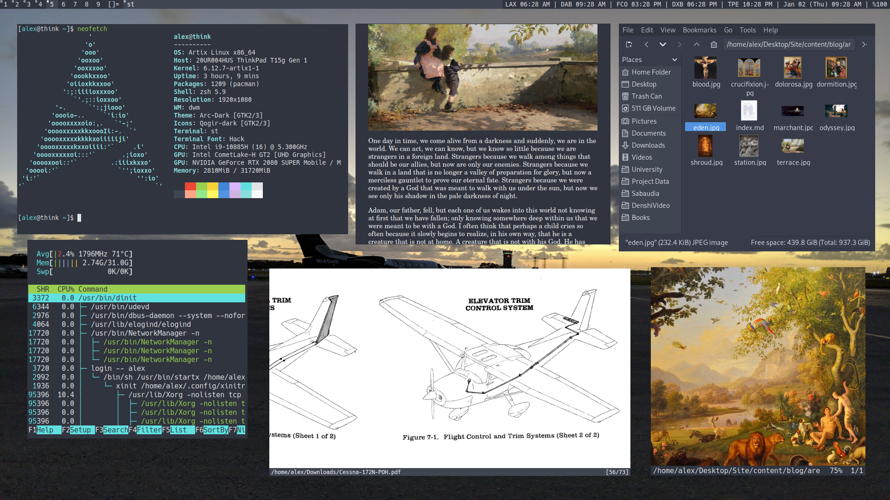

# What is this?

Denshi's dotfiles and autoconfig script.
(For Arch-based Linux Distributions)
 

# What configs does it have?

* Zsh (Prompt and syntax-highlighting)
* GTK (Arc Dark theme)
* htop (Minimal layout)
* dunst (Colors and dimensions)
* mpv (Disable pitch correction)
* newsboat (Colored separators and cool URLs)
* zathura (Colors and clipboard selection)

# What about the scripts? (like cvrt)
All of my scripts are located in my [Scripts repository.](/Scripts)

# What about the programs? (dwm, st)
You can find dwm in the [dwm repostory,](/dwm) and st in the [st repository.](/st).
